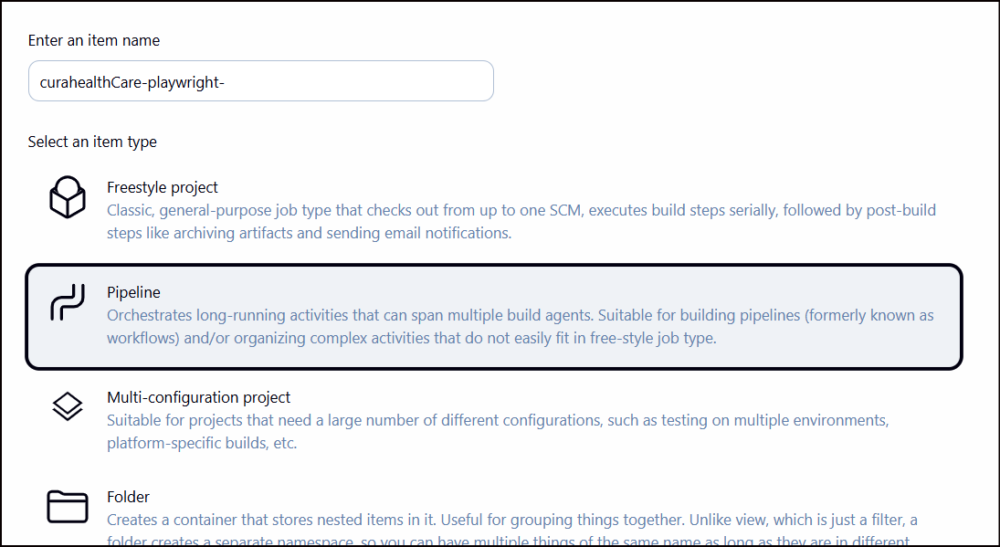
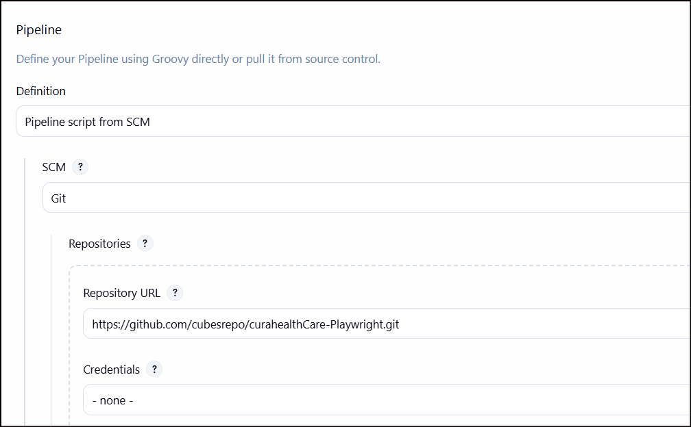
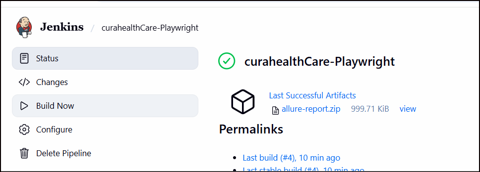

**Hello**🖐 **Automated Testing for Cura Healthcare Demo Website with Playwright, Pytest, POM, Allure Reports, and Jenkins Pipeline**

This project automates testing of the Cura Healthcare Service demo site, covering features like login, appointment booking, and viewing history. It’s designed to handle both standard and edge-case scenarios.

Instead of only validating the happy path, tests cover multiple edge cases to ensure the system behaves correctly under various situations, 
such as:
   - Logging in without a username or password 
   - Logging in with invalid credentials 
   - Booking an appointment without selecting a visit date 
   - Booking an appointment with a past date 
   - Viewing history when no appointments exist
___________________________________________

🎯 **Pre-requisites:**
- Python 3.11.9
- Any browsers(Chrome, Firefox, Edge)
- Browsers: Chrome, Firefox, Edge 
- Playwright installed (pip install playwright)
___________________________________________

▶ **Test Execution**

Run commands: 
1. Install Dependecies:

       pip install -r utilities/requirements.txt
2. Run the test with Allure report:

       pytest -v --alluredir=reports/allure-result
   or specifying browser

       pytest -v --alluredir=reports/allure-result
    

**To run this on jenkins**
1. Add item name, click Pipeline and click OK
    
    
2. Scroll down and navigate to Pipeline then select "pipeline script from SCM" > Select Git > Paste the Repo URL and click Apply and Save
    
   
3. Click build now
    
   

    
   
   
    